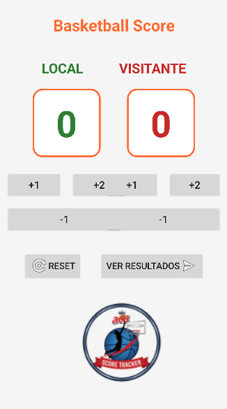
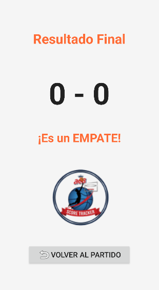

# 🏀 Basket App  
Aplicación Android – Proyecto Profesional  
*(Espacio para logo o imagen principal)*  


---

## 🌟 Descripción General  
**Basket** es una aplicación Android diseñada para ofrecer una experiencia moderna, rápida y eficiente.  
Este repositorio contiene todo el código fuente necesario para compilar y ejecutar la app en cualquier entorno basado en Android Studio.

Incluye:  
- ✔️ Arquitectura limpia y escalable  
- ✔️ Organización modular  
- ✔️ Uso de Gradle para configuración y builds  
- ✔️ Código optimizado para mantenimiento a largo plazo  

---

## 📸 Galería  
*(Agrega aquí capturas de pantalla de tu app)*  
  


---

## 🧱 Estructura del Proyecto

```
basket/
 ├── .idea/               # Configuración del proyecto
 ├── app/                 # Código fuente principal de Android
 ├── gradle/              # Scripts de Gradle
 ├── build.gradle         # Configuración del build
 ├── settings.gradle      # Configuración de módulos
 └── gradle.properties    # Ajustes del compilador y del sistema
```

---

## 🚀 Cómo Ejecutar el Proyecto

### 1️⃣ Clonar el repositorio  
```bash
git clone https://github.com/JvMoramedac/basket.git
cd basket
```

### 2️⃣ Abrir en Android Studio  
- `File` → `Open`  
- Selecciona la carpeta `basket`  
- Espera la sincronización automática de Gradle

### 3️⃣ Ejecutar  
- Conecta un dispositivo o inicia un emulador  
- Haz clic en **Run ▶** para compilar e instalar la app

---

## 📚 Características Principales  
- 📱 Interfaz intuitiva y responsiva  
- ⚙️ Implementación modular  
- 🧩 Dependencias modernas  
- 🔧 Código adaptable a entornos de pruebas  

*(Puedes ampliar esta sección con más detalles técnicos o funcionales)*

---

## 🛠️ Tecnologías Utilizadas  
- **Kotlin / Java**  
- **Android Studio**  
- **Gradle**  
- (Agrega más si lo deseas: Retrofit, Room, Firebase…)

---

## 🧩 Arquitectura  
*(Describe aquí la arquitectura utilizada: MVVM, MVP, Clean Architecture...)*  

Ejemplo:  
- 🧱 **MVVM** para separar lógica y vistas  
- 🎯 **ViewModel** para manejar estados  
- 🔌 **Repository Pattern** para fuentes de datos  

---

## ✨ Mejoras Futuras  
- 🔮 Integración con servicios en la nube  
- 📊 Nueva interfaz basada en Material 3  
- 🧠 Sistema avanzado de estadísticas  
- 🔌 Más conectores y APIs

---

## 👤 Autor  
- **Nombre:** *(Javier Moro)*  
- **GitHub:** [@JvMoramedac](https://github.com/JvMoramedac)
